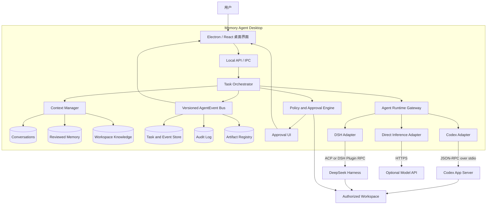

# CLI Agent Runtime 桌面封装实施计划

> 文档状态：待评审实施计划  
> 创建日期：2026-08-28  
> 适用项目：Memory Agent Workbench  
> 目标底层：Codex CLI / DeepSeek Harness，可替换，不在业务层绑定  
> 关联文档：[未来目标与架构路线图](./未来目标与架构路线图.md)

## 一、结论与执行原则

本方案可行。当前项目已经具备 Electron 外壳、本地服务、任务审批、审计、工作区限制和 CLI Runtime 注册表，后续工作的重点不是重写产品，而是把目前分离的“模型聊天”和“CLI 黑盒任务”收敛为统一 Agent Runtime 主链路。

实施采用以下原则：

1. 产品只依赖统一 `AgentRuntime` 协议，不直接依赖 Codex 或 DSH 的私有对象。
2. Codex 作为第一个参考实现，验证协议完整性；这只是实施顺序，不代表永久绑定。
3. DeepSeek Harness 通过独立 Adapter 接入；若标准协议无法提供完整事件，则由 DSH 插件补齐。
4. 原有 OpenAI-compatible、Anthropic、DeepSeek API 接入降为可选 `InferenceProvider`，主要承担轻量生成、摘要和 Embedding，不再承担完整 Agent 运行时职责。
5. 模型只能提出操作；真正的写入、命令、联网、发布和删除必须经过产品权限层。
6. 所有长任务必须可取消、可超时、可审计、可恢复，并能解释当前状态。
7. 首先完成本机单用户、单 Agent、macOS 桌面闭环，再扩展其他平台和多 Agent。

## 二、目标与非目标

### 2.1 本计划目标

- 用户安装桌面应用后，无需手工开启多个终端进程。
- 用户可在设置中选择 Codex 或 DSH 作为执行引擎。
- 对话、任务、工具、审批、产物和记忆使用同一任务状态机。
- Runtime 登录、健康状态、模型、推理强度和权限可在界面中查看。
- Runtime 的消息、计划、工具、审批和结果转换为统一事件。
- 应用退出时可靠清理子进程，异常退出后可以识别并恢复任务状态。
- 没有云端 API Key 时，本地工作区、记忆管理、历史记录和 Runtime 检测仍可使用。

### 2.2 本阶段非目标

- 不在本阶段实现云端多租户、组织权限、计费和远程任务集群。
- 不优先实现专家团、多 Agent 并发和复杂 DAG。
- 不把 Codex Bridge 伪装成 OpenAI-compatible 接口作为长期核心架构。
- 不允许 Runtime 通过自动审批参数绕过桌面应用权限控制。
- 不同时重写现有 UI、记忆系统和所有本地 JSON 数据。
- 不在 macOS 闭环完成前承诺 Windows/Linux 已可发布。

## 三、当前基线

### 3.1 已有能力

| 能力 | 当前实现 | 本计划处理方式 |
| --- | --- | --- |
| 桌面外壳 | `electron/main.cjs` 启动本地 Express 和 React 页面 | 保留并升级为完整进程管理器 |
| 模型聊天 | `server/model.mjs` 直连 OpenAI-compatible / Anthropic | 下沉为可选 `InferenceProvider` |
| CLI 执行 | `server/runtimes.mjs` 支持 `dsh` / `codex` | 演进为有状态 `AgentRuntimeAdapter` |
| CLI 工具入口 | `agent.task` 手工提交整项任务 | 接入聊天主链路和统一 Task 状态机 |
| Work/Code 编排 | `server/workagent.mjs` 已有有界循环雏形 | 重构后成为 Orchestrator 的基础 |
| 权限 | read/write/external 分类，写操作需确认 | 升级为 Runtime 内逐项审批 |
| 审计 | 本地 NDJSON 审计和任务 JSON | 接入统一事件，后续迁移 SQLite |
| 长期记忆 | 候选、审核、生效、禁用、删除 | 保持独立，只从完成任务提议记忆 |
| 测试 | 当前 264 个测试通过，生产构建通过 | 作为重构回归基线 |

### 3.2 当前主要缺口

1. 聊天和 CLI 任务是两条链路，用户对话不会自然进入 Agent 循环。
2. `runAgentTask` 只收集进程最终 stdout/stderr，缺少会话、增量事件、工具步骤和实时审批。
3. `agent.task` 在启动前批准整项任务，不能替代对每个危险命令或文件修改的逐项确认。
4. `WorkAgent` 当前只有模块和测试，没有正式接入聊天 API。
5. Electron 只管理本地服务，没有统一管理 Codex/DSH 子进程、健康检查和退出清理。
6. 当前打包清单没有包含 `plugins/` 和 Runtime 二进制，开发模式可用不代表安装包可用。
7. 本地 API 使用固定端口 `8787`，缺少动态端口、单实例和端口冲突处理。
8. Codex Bridge、Codex CLI 调用和 DSH Codex Provider 存在能力重叠，需要收口。

## 四、目标架构



### 4.1 主链路

```text
用户消息
  -> 创建 Task
  -> 加载角色、会话、记忆和工作区上下文
  -> 选择 Agent Runtime
  -> 创建或恢复 Runtime Session
  -> 接收增量消息、计划和工具提议
  -> 权限层自动放行安全只读操作，拦截高风险操作
  -> 用户确认或拒绝
  -> Runtime 继续执行
  -> 验证结果、登记产物和证据
  -> 完成 Task
  -> 提议长期记忆候选，等待用户审核
```

## 五、核心协议设计

### 5.1 AgentRuntimeAdapter

第一阶段冻结以下语义，具体 TypeScript 类型在实施时通过 ADR 定稿：

```ts
interface AgentRuntimeAdapter {
  id: "codex" | "dsh" | string;
  probe(): Promise<RuntimeHealth>;
  getAuthState(): Promise<AuthState>;
  startLogin?(input: LoginRequest): Promise<LoginChallenge>;
  createSession(input: CreateSessionInput): Promise<RuntimeSession>;
  resumeSession?(sessionId: string): Promise<RuntimeSession>;
  send(sessionId: string, input: RuntimePrompt): AsyncIterable<AgentEvent>;
  approve(sessionId: string, approval: ApprovalDecision): Promise<void>;
  cancel(sessionId: string): Promise<void>;
  disposeSession(sessionId: string): Promise<void>;
  shutdown(): Promise<void>;
}
```

Adapter 必须声明能力，UI 不猜测底层是否支持：

```ts
interface RuntimeCapabilities {
  streaming: boolean;
  sessions: boolean;
  resume: boolean;
  approvals: boolean;
  toolEvents: boolean;
  artifacts: boolean;
  modelSelection: boolean;
  reasoningEffort: boolean;
}
```

### 5.2 AgentEvent

事件必须带 `schemaVersion`、`taskId`、`sessionId`、`sequence` 和时间戳。首版至少支持：

- `runtime.started`
- `runtime.status_changed`
- `session.created`
- `message.delta`
- `message.completed`
- `plan.updated`
- `tool.proposed`
- `approval.requested`
- `approval.resolved`
- `tool.started`
- `tool.completed`
- `tool.failed`
- `artifact.created`
- `task.completed`
- `task.failed`
- `task.cancelled`

Runtime 私有事件只能保存在 `raw` 字段或 Adapter 内部，不允许直接泄漏到业务层。

### 5.3 权限模型

首版权限分类：

| 权限 | 默认策略 | 示例 |
| --- | --- | --- |
| `read` | 授权工作区内可自动 | 读文件、搜索代码、查看 Git 状态 |
| `write` | 每次或明确批次确认 | 修改文件、生成文档、应用补丁 |
| `execute` | 展示命令后确认 | shell、测试、构建、包管理器 |
| `network` | 按域名或请求确认 | 下载依赖、访问外部 API |
| `external` | 必须确认 | 发消息、创建远程任务、修改 SaaS 数据 |
| `publish` | 必须确认 | Git push、发布包、部署 |
| `delete` | 必须确认并优先可恢复 | 删除文件、清理数据 |

权限批准必须绑定具体 `taskId + runtimeSessionId + toolCallId + 参数摘要`。不得把“允许本次任务”解释为无限制的 `workspace-write` 或网络权限。

## 六、模型与 Runtime 配置迁移

### 6.1 当前问题

当前 `selectedProvider` 同时承担聊天模型、摘要模型和 Codex Bridge 选择，导致“模型供应商”和“Agent 执行引擎”混为一层。

### 6.2 目标配置

```text
runtime.json
├── selectedRuntime
├── adapters.codex
│   ├── binaryMode: system | bundled
│   ├── binaryPath
│   ├── defaultModel
│   ├── reasoningEffort
│   └── defaultSandbox
└── adapters.dsh
    ├── binaryMode: system | bundled
    ├── binaryPath
    ├── profile
    └── defaultPermissionMode

models.json
├── inference.selectedProvider
├── inference.providers
└── embedding.selectedProvider
```

迁移规则：

1. 保留现有 `models.json` 兼容读取，不一次性破坏用户配置。
2. 如果旧配置选择 `codex`，迁移为 `selectedRuntime = codex`；不把占位 API Key 当作真实凭据。
3. OpenAI、DeepSeek、Anthropic 等仍保留在 `inference.providers`。
4. OAuth Token、API Key 和密码不得写入迁移日志、任务事件和长期记忆。
5. 配置迁移前创建备份，失败时继续使用旧配置并提示用户。

## 七、分阶段实施

### M0：协议冻结与现状收口

#### 目标

建立后续所有 Runtime 必须遵守的公共边界，停止继续增加专用分支。

#### 工作项

- 编写 `AgentRuntimeAdapter`、`RuntimeCapabilities`、`AgentEvent`、`ApprovalRequest` ADR。
- 盘点 `server/model.mjs`、`server/runtimes.mjs`、`server/workagent.mjs`、`server/tools.mjs` 的职责和迁移路径。
- 给现有 Codex Bridge、DSH Provider、`agent.task` 标注保留、兼容或淘汰结论。
- 建立 Runtime fake adapter，供单元测试和前端开发使用。
- 固定事件顺序、错误结构、取消语义和输出大小限制。

#### 交付物

- Runtime 协议 ADR。
- TypeScript 类型和事件 Schema。
- 旧接口到新接口的迁移表。
- Fake Runtime 与协议测试。

#### 完成标准

- Codex 和 DSH Adapter 可以只依赖公共协议开发。
- 新代码不再直接判断 `provider.id === "codex"` 或 `backend === "dsh"` 后进入业务分支。
- 协议测试覆盖正常完成、失败、取消、审批和未知事件。

### M1：统一 Task Orchestrator

#### 目标

把聊天、工具和 CLI 任务接入同一状态机。

#### 工作项

- 将 `WorkAgent` 演进为正式 `TaskOrchestrator`。
- 聊天 API 创建 Task，而不是直接调用 `callModel`。
- 保留 `DirectInferenceAdapter`，用于无工具轻量对话和迁移期兼容。
- 建立最大步数、最大耗时、上下文预算和取消信号。
- 工具结果、Runtime 事件和最终答复写入同一任务记录。
- 任务结束后只生成记忆候选，不直接写入活跃长期记忆。

#### 交付物

- 统一 Task 状态机。
- Runtime 驱动的流式聊天端点。
- 任务详情和事件时间线。
- Direct Inference 兼容 Adapter。

#### 完成标准

- 普通对话、只读工具任务和需要审批的写任务都从同一入口运行。
- 用户可取消正在执行的任务。
- Runtime 或工具失败后任务不会被误标为完成。
- 现有会话、记忆和模型配置仍可读取。

### M2：Codex App Server Adapter

#### 目标

完成第一个具备完整交互能力的 Runtime，实现协议参考版本。

#### 工作项

- 用 `codex app-server --stdio` 替换核心链路中的 `codex exec` 黑盒调用。
- 实现初始化、账号状态、ChatGPT 登录、会话创建、消息发送和取消。
- 转换消息、计划、命令、文件修改、审批和完成事件。
- 将 Codex 命令/文件审批请求映射到产品 Approval UI。
- 默认 `read-only`；只有产品批准后才响应对应审批请求。
- 处理进程退出、协议损坏、超时、取消和孤儿进程清理。
- 保留旧 Codex Bridge 作为迁移兼容入口，标注弃用周期。

#### 交付物

- `CodexRuntimeAdapter`。
- Codex 登录与运行状态设置页。
- Codex 事件映射测试。
- 真实 Codex 端到端烟测。

#### 完成标准

- 使用本机 ChatGPT 登录完成一次只读项目分析。
- 文件修改前桌面端出现可审查审批，拒绝后文件不变。
- 用户取消后 Codex turn 和子进程均停止。
- 应用重启后不会遗留无法识别的运行任务。

### M3：Electron Runtime Process Manager

#### 目标

让普通用户不需要手工启动 Bridge、Codex 或 DSH 服务。

#### 工作项

- 增加单实例锁和动态本地端口。
- 建立 Runtime 发现、启动、健康检查、重启和关闭管理器。
- 明确 system CLI 与 bundled CLI 两种分发模式。
- 运行时日志写入用户数据目录，执行脱敏和大小轮转。
- 应用退出时执行 Stop Hook，停止本地服务与全部 Runtime 子进程。
- 将管理令牌、动态端口和 Runtime 状态通过安全 IPC 传递给 Renderer。
- 修正 electron-builder 的 `files`、`extraResources`、`asarUnpack` 和第三方许可证清单。

#### 交付物

- `RuntimeProcessManager`。
- Runtime 安装/缺失/版本不兼容诊断页。
- 更新后的打包配置。
- 未签名本机测试包。

#### 完成标准

- 干净用户环境可首次启动并清楚看到 Runtime 是否可用。
- 已安装 Runtime 可自动发现；未安装时不静默失败。
- 端口被占用时应用自动选择可用端口。
- 正常退出和强制关闭后无孤儿进程。

### M4：DeepSeek Harness Adapter 与决策门

#### 目标

验证同一协议是否能稳定承载第二个 Runtime，并据此决定正式默认底层。

#### 工作项

- 先以 ACP 完成启动、会话、提示、取消和一次性权限响应。
- 评估 ACP 缺失的增量消息、计划、工具活动和产物事件。
- 若产品体验不足，开发最小 DSH 插件输出标准化事件，不修改业务层。
- 隔离 `DSH_HOME`，避免测试或预览污染用户现有配置。
- 完成版本探测、兼容矩阵和破坏性升级提示。
- 对 Codex/DSH 执行同一组验收任务，记录结果。

#### 交付物

- `DshRuntimeAdapter`。
- 必要时提供 DSH Event Bridge 插件。
- Codex/DSH 能力与稳定性对比报告。
- 默认 Runtime 决策记录。

#### 完成标准

- 业务层不改代码即可在 Codex 和 DSH 间切换。
- DSH 权限响应缺失时安全拒绝，不自动放行。
- DSH 升级不兼容时提供明确诊断，不破坏用户数据。
- 同一任务在两个 Runtime 下产生相同结构的任务记录和产物引用。

### M5：数据恢复、安全和公开分发准备

#### 目标

完成从“本机可运行”到“可安装、可恢复、可审查”的产品闭环。

#### 工作项

- 将任务、步骤、事件、审批和产物迁移到 SQLite 权威存储。
- 为 JSON/Markdown 旧数据提供版本化迁移、备份和回滚。
- API Key 优先进入系统 Keychain；Runtime 自有 OAuth 由 Runtime 管理。
- 增加崩溃恢复、运行中任务中断标记和诊断导出。
- 完成 macOS Hardened Runtime、签名、公证和 Gatekeeper 验证。
- 审核 Codex、DSH 和第三方依赖的许可证、NOTICE、品牌与再分发要求。
- 验证安装、升级、降级、卸载保留数据和彻底清除数据。

#### 交付物

- SQLite schema 和迁移工具。
- 备份/恢复与诊断功能。
- 签名公证安装包。
- 发布前安全与许可证清单。

#### 完成标准

- 干净 macOS 用户完成安装、登录、任务、审批、重启恢复和卸载验证。
- 应用日志、任务和长期记忆中不出现密钥或 OAuth Token。
- 数据迁移失败可回滚，旧数据不丢失。
- Gatekeeper 验证通过，安装包内第三方许可证完整。

## 八、Codex / DSH 决策门

底层最终选择在 M4 完成后决定，不以主观偏好提前锁定。评估使用同一套任务和指标：

| 维度 | 关键问题 |
| --- | --- |
| 协议完整性 | 是否提供流式消息、会话、工具、审批、取消和恢复？ |
| 安全 | 是否能做到 fail-closed，是否可限制工作区和网络？ |
| 稳定性 | 升级是否频繁破坏接口，崩溃和清理是否可靠？ |
| 登录与凭据 | 用户是否能在桌面端完成登录，Token 是否由 Runtime 安全管理？ |
| 可观测性 | 是否能构建真实任务时间线，而不是只有最终文本？ |
| 扩展能力 | Skill、MCP、插件和自定义模型的接入成本如何？ |
| 打包成本 | 二进制大小、平台支持、许可证和升级机制是否可控？ |
| 用户体验 | 首次启动、速度、审批、取消和错误诊断是否清晰？ |

初始假设：

- Codex 作为 M2 参考实现，优先验证完整桌面闭环。
- DSH 作为 M4 可替换实现，重点验证插件扩展和多模型能力。
- 若 DSH 在稳定性或事件协议上未达到要求，仍保留为实验性 Runtime，不阻塞 Codex 版本发布。

## 九、验收测试矩阵

每个 Runtime 至少通过以下场景：

1. Runtime 未安装：显示诊断和安装指引，应用其他本地能力可用。
2. 未登录或凭据失效：允许重新登录，不暴露 Token。
3. 只读任务：自动执行并返回带证据的结果。
4. 工作区外读取：被拒绝并记录策略事件。
5. 文件写入：展示目标路径和变更摘要，批准后执行。
6. 拒绝写入：任务继续调整或安全结束，文件保持不变。
7. 命令执行：展示命令、cwd 和风险，批准后运行。
8. 联网请求：按策略确认，不允许静默扩大域名范围。
9. 长任务取消：Runtime、工具和子进程全部停止。
10. Runtime 崩溃：任务标记失败，可查看诊断并重新执行。
11. 应用重启：运行中任务标记中断，已完成记录和产物仍可访问。
12. 输出过长：正文截断但产物和完整日志引用可追踪。
13. 并发任务：不串会话、不串工作区、不串审批。
14. 记忆提炼：只生成候选，拒绝后不进入活跃记忆。
15. 打包版启动：无需开发终端即可完成完整链路。

## 十、主要风险与控制措施

| 风险 | 影响 | 控制措施 |
| --- | --- | --- |
| 把 CLI 当黑盒 | 无法展示步骤和逐项审批 | 使用 App Server/ACP/插件事件协议 |
| 自动审批绕过权限 | Runtime 获得过大副作用权限 | 产品审批为唯一授权来源，默认 fail-closed |
| Runtime 协议频繁变化 | 升级导致产品不可用 | Adapter 隔离、版本探测、契约测试、兼容矩阵 |
| 打包漏掉 Runtime 资源 | 开发可用、安装包不可用 | clean-room 安装测试和资源清单检查 |
| Token 进入日志或记忆 | 凭据泄漏 | Runtime 管理 OAuth、Keychain、日志脱敏、敏感字段拒绝 |
| 固定端口冲突 | 桌面启动失败 | 动态端口和安全 IPC 发现 |
| 子进程残留 | 资源泄漏和状态错乱 | 进程树管理、父进程监控、Stop Hook |
| DSH developer preview 变更 | 维护成本高 | 先通过 Adapter 接入，默认底层延后决策 |
| 数据迁移失败 | 会话和记忆丢失 | 版本迁移、备份、回滚和恢复测试 |
| 开源许可与模型服务条款混淆 | 发布或品牌风险 | 发布前分别审查代码许可、品牌规范和模型服务条款 |

## 十一、建议的近期任务顺序

下一轮开发只推进 M0，不直接开始大规模改代码：

1. 新建 Runtime ADR，冻结 Adapter、Capabilities、Event、Approval 接口。
2. 建立现有接口迁移表，确定哪些 Bridge 保留为兼容层。
3. 增加 Fake Runtime 和协议测试。
4. 设计 `runtime.json` 与 `models.json` 兼容迁移。
5. 设计聊天 API 到 Task Orchestrator 的最小迁移切片。
6. M0 评审通过后，再实现 Codex App Server Adapter。

M0 评审时必须回答：

- Runtime 私有事件如何降级为公共事件？
- 一次审批精确授权什么，何时失效？
- Task、Runtime Session、Conversation 三者如何关联？
- Runtime 断开后哪些状态可以恢复，哪些必须失败？
- 旧 Codex Bridge 和 `agent.task` 保留多久，迁移入口是什么？
- system CLI 与 bundled CLI 哪一种作为首个安装包策略？

## 十二、项目完成定义

本计划的“完成”不是测试和构建通过，而是同时满足：

- 用户在干净 macOS 环境安装应用，无需手工启动终端服务。
- 用户可以选择并运行至少一个正式 Runtime，第二个 Runtime 可通过 Adapter 接入。
- 对话能够驱动有界 Agent 循环，并展示真实任务状态。
- 每个危险操作都可审查、可拒绝、可追踪。
- Runtime、应用和操作系统异常退出后，任务和数据状态可解释、可恢复或明确失败。
- 产物、任务证据和长期记忆严格分层。
- 打包、签名、公证、许可证、数据迁移和卸载策略完成真实验证。
