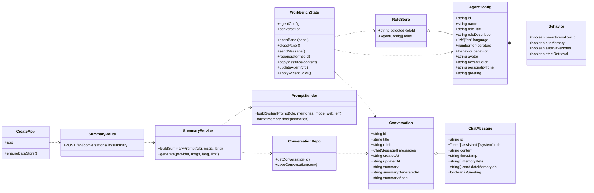
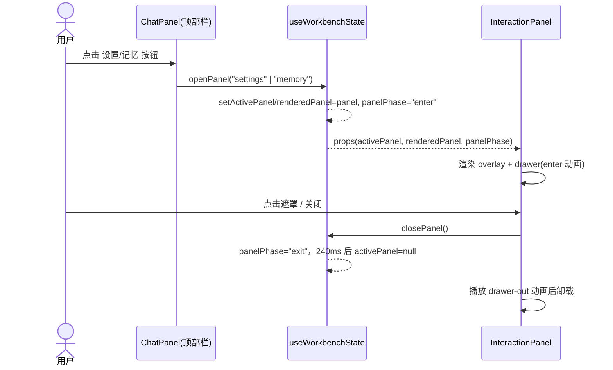
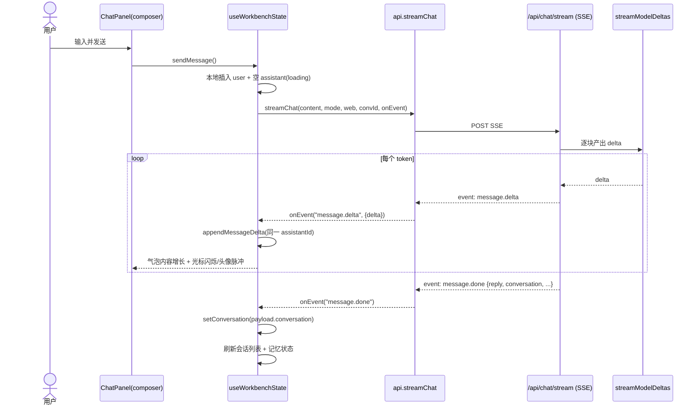
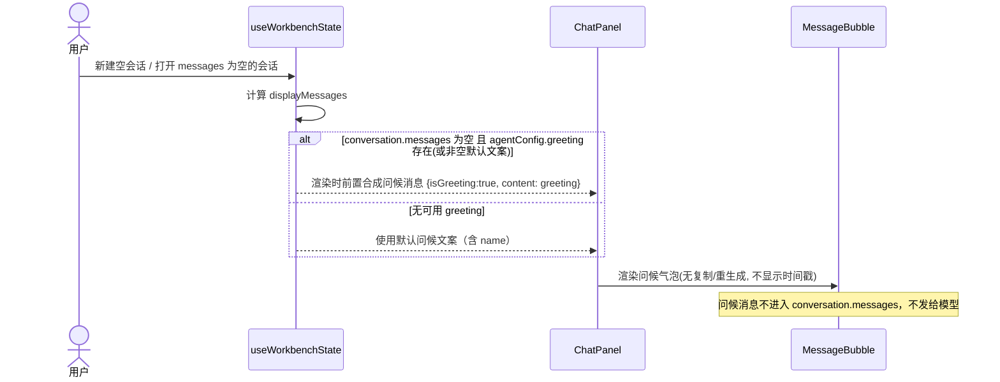
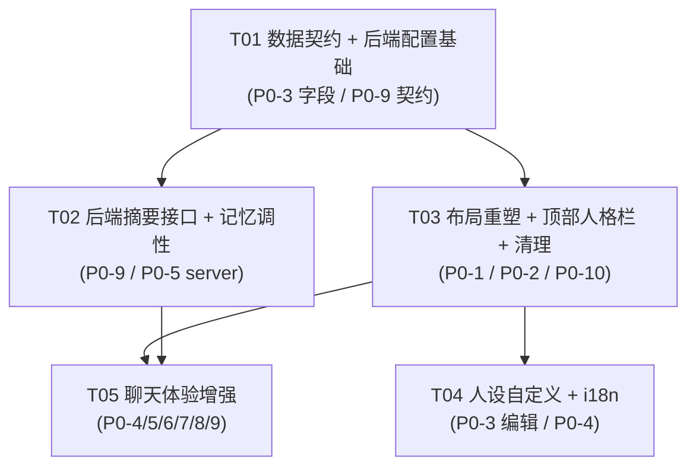

# 系统架构设计 + 任务分解：Memory Agent Workbench 陪聊化改造

> 文档版本：v1.0 ｜ 作者：架构师（高见远）｜ 日期：2026-07-15
> 关联 PRD：`docs/prd-companion-refresh.md`（增量陪聊化改造）、`docs/PRD-会话摘要真接入AI.md`（P0-9 沿用）
> 项目根：`/Users/jiayancheng/Documents/聊天智能体`

---

## 1. 实现方案 + 框架选型

### 1.1 核心结论

**沿用现有栈，不引入新框架/新运行时依赖。** 经代码走查确认：

- 前端已有 React 19 + TS + Vite 7，`useWorkbenchState` 作为唯一状态中枢，组件均消费 `WorkbenchProps`；抽屉机制（`openPanel/closePanel/activePanel/renderedPanel/panelPhase`）已就绪，可零成本复用做"收纳"。
- 后端 `server/app.mjs` 的 `createApp` 工厂 + `Express 5` 已具备 `/api/chat/stream`（SSE + `streamModelDeltas`）。**流式能力已存在**，P0-8 无需改 server，仅前端做打字动效。
- 后端 `callModel`、`conversations` 读写、`roles.json` 持久化均已就绪，P0-9 摘要仅需新增一个路由 + 一个 prompt 构造器。

### 1.2 技术难点与对应策略

| 难点 | 策略 | 改动面 |
|------|------|--------|
| 三栏工作台 → 聊天主视图 + 抽屉 | 桌面 `DesktopWorkbench` 退化为纯 `ChatPanel`；`AgentSidebar`/`MemoryPanel` 常驻改为经 `openPanel` 进抽屉 | 前端布局 |
| 人格化（头像/颜色/性格/开场白） | `AgentConfig` 新增 4 字段，`normalizeRoleStore` 用默认 spread 自动补齐；`accentColor` 经 CSS 变量注入；开场白前端虚拟注入（不落库、不进模型上下文） | 前端 + `config.mjs` 默认值 |
| 记忆自然外露 | 后端 `prompt.mjs` 改写 `citeMemory` 指令为"温暖克制"；前端把"引用 N 条记忆"技术标签改为默认折叠脚注 | 前端 + `prompt.mjs` |
| 会话摘要真接入 | 新增 `POST /api/conversations/:id/summary`（复用 `callModel`，`temperature=0.2`，`max_tokens=800`），前端 `generateSummary()` 改走接口 | 前后端 |
| 最小化改动 vs 结构清晰 | 新增独立样式文件 `src/companion.css` 隔离陪聊新样式，不污染既有 `styles.css`；人设编辑器独立为 `PersonaEditor.tsx`；后端摘要逻辑独立为 `server/summary.mjs` | 前后端 |

### 1.3 框架/库选型（确认沿用）

- **前端**：React 19 + TypeScript + Vite 7（既有）；`react-markdown` + `remark-gfm` + `rehype-sanitize`（消息渲染，既有）；`lucide-react`（图标，既有）。**无新增依赖**。
- **后端**：Node + Express 5 + `express-rate-limit`（既有，摘要接口复用其 `writeLimiter` + `adminAuth`）。**无新增依赖**。
- **样式**：原生 CSS 变量 + `color-mix()`（现代浏览器原生，用于由 `accentColor` 派生柔和色），无需 CSS-in-JS 库。
- **剪切板**：原生 `navigator.clipboard.writeText`，无需第三方库。

---

## 2. 文件列表（区分 修改 / 新增，标注 P0）

| # | 文件路径 | 操作 | 负责 P0 | 说明 |
|---|----------|------|---------|------|
| 1 | `src/types.ts` | 修改 | P0-3, P0-9 | `AgentConfig` 增 `avatar`/`accentColor`/`personalityTone`/`greeting`；`ChatMessage` 增 `isGreeting`；`Conversation` 增 `summary`/`summaryGeneratedAt`/`summaryModel` |
| 2 | `src/workbenchTypes.ts` | 修改 | P0-3, P0-7 | `WorkbenchProps` 增 `regenerate`/`copyMessage`；`ActivePanel` 不变（复用 settings/memory/tools） |
| 3 | `src/api.ts` | 修改 | P0-9 | 增 `generateSummary: (id) => POST /api/conversations/${id}/summary` |
| 4 | `src/i18n.ts` | 修改 | P0-2, P0-3, P0-4, P0-5, P0-6, P0-7 | 增 `persona` / `header` / `message`(regenerate/copy/referenced) 等中文键；en 文案同步但 UI 不暴露切换 |
| 5 | `src/main.tsx` | 修改 | P0-1 | 引入 `./companion.css`（新样式隔离） |
| 6 | `src/companion.css` | **新增** | P0-1, P0-2, P0-3, P0-8 | 陪聊专属样式：`--accent` 变量体系、顶部人格栏、用户气泡随 accent、流式光标/脉冲头像、记忆折叠脚注、重生成/复制工具条 |
| 7 | `src/hooks/useWorkbenchState.ts` | 修改 | P0-3, P0-4, P0-7, P0-8, P0-9 | `accentColor→CSS变量` effect；`regenerate()`；`copyMessage()`；`generateSummary()` 改走接口；送话语义统一 |
| 8 | `src/components/ChatPanel.tsx` | 修改 | P0-1, P0-2, P0-4, P0-6, P0-7, P0-8, P0-10 | 顶栏人格化（头像/名/状态）；移除常驻侧栏依赖；`MessageBubble` 加时间戳/工具条/流式光标/记忆脚注；隐藏 Mic/Paperclip/en 切换；开场白虚拟注入 |
| 9 | `src/components/Workbenches.tsx` | 修改 | P0-1, P0-10 | `DesktopWorkbench` 退为纯 `ChatPanel`；移动端移除 phone-frame 外壳 |
| 10 | `src/components/SettingsPanels.tsx` | 修改 | P0-1, P0-3 | 抽出可复用子区块（`ConversationSwitcher`/`RoleSwitcher` 已存在）；新增 `DrawerSettingsPanel` 把会话/角色/人设/行为/温度/模型组装进抽屉；`PersonaEditor` 嵌入 |
| 11 | `src/components/MemoryPanel.tsx` | 修改 | P0-1 | 仅作抽屉内容（`MemoryDetailPanel` 已存在），移除常驻路径依赖；保证 header 入口按钮可用 |
| 12 | `src/components/PersonaEditor.tsx` | **新增** | P0-3, P0-4 | emoji 头像选择器 + 16 色预设块 + `personalityTone` 文本域 + `greeting` 文本域；调用 `updateAgent` 持久化 |
| 13 | `src/components/InteractionPanel.tsx` | 修改 | P0-9 | `SummaryPanel` 走真实接口（已通过 `generateSummary` 改造自动生效） |
| 14 | `server/config.mjs` | 修改 | P0-3 | `defaultAgentConfig` 增 4 字段默认值；`normalizeRoleStore` 经 spread 自动补齐（几乎零改） |
| 15 | `server/prompt.mjs` | 修改 | P0-5 | 改写 `citeMemory` 指令为"温暖克制自然外露"；新增 `buildSummaryPrompt`（或放 summary.mjs） |
| 16 | `server/summary.mjs` | **新增** | P0-9 | `buildSummaryPrompt(agentConfig, messages, language)` + `generateConversationSummary(provider, messages, language)` 安全护栏 |
| 17 | `server/app.mjs` | 修改 | P0-9 | 注册 `POST /api/conversations/:conversationId/summary`（adminAuth + writeLimiter），读最近 N 条、写回 summary 字段 |

**哪些 P0 需要动 server/：**
- 需要动 server：`P0-3`（仅 `config.mjs` 默认值，极小）、`P0-5`（`prompt.mjs` 指令改写）、`P0-9`（新增 `summary.mjs` + `app.mjs` 路由）。
- **纯前端**：`P0-1`、`P0-2`、`P0-4`、`P0-6`、`P0-7`、`P0-8`、`P0-10`。
- 特别说明：`P0-8` 流式——后端 SSE 已就绪（`/api/chat/stream` + `streamModelDeltas`），**无需 server 改动**，仅前端动效。

---

## 3. 数据结构和接口（Mermaid 类图）



**新增/变更字段说明**

- `AgentConfig.avatar: string` — emoji（如 "🤖"），默认 `"🤖"`。
- `AgentConfig.accentColor: string` — 16 进制色（如 `"#2563eb"`），默认 `"#2563eb"`。
- `AgentConfig.personalityTone: string` — 性格口吻自由文本，默认 `""`。
- `AgentConfig.greeting: string` — 静态开场白，默认 `""`（空则用默认文案）。
- `ChatMessage.isGreeting: boolean` — 标记虚拟开场白，默认 `false`；**不写入后端**。
- `Conversation.summary / summaryGeneratedAt / summaryModel: string` — 摘要持久化，可选。

**后端接口（沿用 + 新增）**

| 方法 & 路径 | 说明 | 请求 | 响应 |
|-------------|------|------|------|
| `GET /api/roles` | 读取角色（含新字段，经 normalize 补齐） | — | `RoleStore` |
| `PUT /api/roles/:roleId` | 更新人设（含 avatar/accentColor/...） | `Partial<AgentConfig>` | `RoleStore` |
| `GET /api/conversations/:id` | 读取会话（带回 `summary` 字段） | — | `Conversation` |
| **`POST /api/conversations/:conversationId/summary`** | **新增**：真接入模型生成摘要 | `{ limit?: number, language?: "zh"|"en" }` | `{ summary, generatedAt, model, messageCount }`；空对话 `400 {code:"EMPTY_CONVERSATION"}`；失败 `502 {code:"SUMMARY_FAILED", message}` |
| `POST /api/chat/stream` | 既有 SSE 流式（P0-8 复用，不改） | — | `message.delta` / `message.done` / `memory.candidates` |

---

## 4. 程序调用流程（Mermaid 时序图）

> 重点覆盖：抽屉开关、发送消息流式、重新生成、开场白注入、摘要生成。完整版见 `docs/sequence-diagram.mermaid`。

### 4.1 抽屉开关（P0-1）



### 4.2 发送消息流式（P0-8 复用既有 SSE）



### 4.3 重新生成（P0-7）

```mermaid
sequenceDiagram
    actor U as 用户
    participant MB as MessageBubble(助手)
    participant S as useWorkbenchState
    participant API as api.streamChat
    participant SRV as /api/chat/stream
    U->>MB: 点击「重新生成」
    MB->>S: regenerate(targetAssistantId)
    S->>S: 取最后一条 user 消息内容
    S->>S: 清空该 assistant 内容, sending=true (复用同 id)
    S->>API: streamChat(lastUserContent, mode, web, convId, onEvent)
    API->>SRV: POST SSE（同 4.2 流程）
    SRV-->>API: message.delta 流
    API-->>S: onEvent("message.delta")
    S->>S: appendMessageDelta(targetAssistantId)
    SRV-->>API: message.done {reply, conversation}
    API-->>S: onEvent("message.done")
    S->>S: setConversation(payload.conversation); sending=false
    Note over S: 失败则保留原内容并 toast（不破坏历史）
```

### 4.4 开场白虚拟注入（P0-4）



### 4.5 摘要生成（P0-9 真接入）

```mermaid
sequenceDiagram
    actor U as 用户
    participant SP as SummaryPanel
    participant S as useWorkbenchState
    participant API as api.generateSummary(convId)
    participant SRV as POST /api/conversations/:id/summary
    participant P as buildSummaryPrompt
    participant M as callModel(temp=0.2)
    participant R as ConversationRepo
    U->>SP: 点击「生成摘要」
    SP->>S: generateSummary()
    S->>API: POST summary
    API->>SRV: 请求 {limit?, language?}
    SRV->>R: getConversation(id)
    SRV->>P: buildSummaryPrompt(agentConfig, 最近 N 条, language)
    SRV->>M: callModel(provider, messages, 0.2, max_tokens=800)
    M-->>SRV: summary 文本
    SRV->>R: 写 conversation.summary / summaryGeneratedAt / summaryModel
    SRV-->>API: {summary, generatedAt, model, messageCount}
    API-->>S: res
    S->>S: setGeneratedSummary(res.summary); openPanel("summary")
    Note over SRV: 空对话→400 EMPTY_CONVERSATION；模型失败→502 SUMMARY_FAILED 且不改原数据
```

---

## 5. 任务列表（有序 / 依赖 / 角色 / P0 编号）

| 任务 ID | 名称 | 源文件（修改 / 新增） | 依赖 | 负责人角色 | 对应 P0 | 优先级 |
|---------|------|------------------------|------|------------|---------|--------|
| **T01** | 数据契约与后端配置基础 | `src/types.ts`(改) · `src/workbenchTypes.ts`(改) · `src/api.ts`(改) · `server/config.mjs`(改) | — | 后端工程师 + 前端工程师 | P0-3(字段定义) · P0-9(类型与 API 契约) | P0 |
| **T02** | 后端：会话摘要接口 + 记忆外露调性 | `server/summary.mjs`(新) · `server/app.mjs`(改) · `server/prompt.mjs`(改) | T01 | 后端工程师 | P0-9 · P0-5(server 侧) | P0 |
| **T03** | 前端布局重塑：聊天主视图 + 抽屉收纳 + 顶部人格栏 + 清理入口 | `src/components/Workbenches.tsx`(改) · `src/components/ChatPanel.tsx`(改) · `src/components/SettingsPanels.tsx`(改) · `src/components/MemoryPanel.tsx`(改) · `src/main.tsx`(改) · `src/companion.css`(新) | T01 | 前端工程师 | P0-1 · P0-2 · P0-10 | P0 |
| **T04** | 前端人设自定义 + 国际化文案 | `src/components/PersonaEditor.tsx`(新) · `src/components/SettingsPanels.tsx`(改) · `src/i18n.ts`(改) · `src/hooks/useWorkbenchState.ts`(改) | T01, T03 | 前端工程师 | P0-3(编辑) · P0-4(greeting 编辑) | P0 |
| **T05** | 前端聊天体验增强：开场白渲染 / 时间戳 / 重生成 / 复制 / 流式动效 / 记忆脚注 / 摘要前端 | `src/hooks/useWorkbenchState.ts`(改) · `src/components/ChatPanel.tsx`(改) · `src/components/InteractionPanel.tsx`(改) · `src/companion.css`(改) | T01, T02, T03 | 前端工程师 | P0-4(渲染) · P0-5(前端脚注) · P0-6 · P0-7 · P0-8 · P0-9(前端) | P0 |

> 依赖关系图见 `docs/sequence-diagram.mermaid` 之外的文末 **§7 任务依赖图**。
> 说明：T03 与 T05 都涉及 `ChatPanel.tsx` 与 `companion.css`，实现顺序上 T03 先落地布局骨架与新样式基底，T05 在其上追加体验细节，无冲突。

---

## 6. 依赖包列表

**运行时依赖（新增）**：无。

**沿用既有依赖（无需升级）**：
```
- react@^19.0.0 / react-dom@^19.0.0            # 前端框架（既有）
- vite@^7.0.0 / @vitejs/plugin-react@^5.0.0    # 构建（既有）
- typescript@^5.8.0                            # 类型（既有）
- react-markdown@^10.1.0 / remark-gfm@^4.0.1 / rehype-sanitize@^6.0.0  # 消息渲染（既有）
- lucide-react@^0.468.0                        # 图标（既有）
- express@^5.1.0 / cors@^2.8.5 / express-rate-limit@^8.5.2  # 后端（既有）
- vitest@^4.1.10                               # 单测（既有）
```
**说明**：`accentColor` 派生柔和色使用 CSS 原生 `color-mix()`；复制使用原生 `navigator.clipboard`；均不引入第三方库。如需降级兼容老浏览器，`color-mix` 可退化为预先生成的 `--accent-soft` 写死值（本期默认现代浏览器）。

---

## 7. 共享知识（跨文件约定）

### 7.1 `accentColor` → CSS 变量注入约定
- **唯一注入点**：`useWorkbenchState` 内 `useEffect`，当 `agentConfig.accentColor` 变化时执行：
  `document.documentElement.style.setProperty("--accent", agentConfig.accentColor || "#2563eb")`。
- **CSS 消费**（`src/companion.css` 定义）：`--accent` 为主色；`--accent-soft: color-mix(in srgb, var(--accent) 12%, #ffffff)`；`--accent-ink: color-mix(in srgb, var(--accent) 78%, #0b1020)`。
- **应用位置**：用户气泡背景/文字、发送按钮、Segmented 选中态、focus 描边、助手头像底色、链接色。既有 `styles.css` 的 `--blue` 保持不变作为兜底；新元素一律用 `var(--accent, var(--blue))`。
- 默认色与 16 色预设块在 `PersonaEditor.tsx` 内常量 `ACCENT_PRESETS`（如 `#2563eb #16a34a #db2777 #d97706 #7c3aed #0891b2 #dc2626 #0d9488 #ca8a04 #4f46e5 #e11d48 #65a30d #0ea5e9 #9333ea #f97316 #475569`）。

### 7.2 抽屉状态与 `useWorkbenchState` 协同约定
- 顶部栏按钮统一调用 `openPanel("settings" | "memory" | "tools")`；关闭由 `InteractionPanel` 遮罩/关闭键触发 `closePanel()`。
- `settings` 抽屉内容 = `DrawerSettingsPanel`（会话列表 + 角色预设 + 人设编辑 + 行为开关 + 温度 + 模型），复用既有 `ConversationSwitcher`/`RoleSwitcher` 子组件与 `PersonaEditor`。
- `memory` 抽屉 = 既有 `MemoryDetailPanel`；`tools` 抽屉 = 既有 `ToolsPanel`（含联网搜索、整理记忆、生成摘要、提交候选）。
- 不新增 `ActivePanel` 枚举值，避免改动 `workbenchTypes.ts` 的联合类型扩散。

### 7.3 开场白（greeting）约定
- **前端虚拟注入，不落库、不进模型上下文**：当 `conversation.messages.length === 0` 时，`ChatPanel` 渲染前置一条合成消息 `{ id: "__greeting__", role:"assistant", content: agentConfig.greeting || defaultGreeting(name), timestamp: conversation.createdAt, isGreeting:true, memoryRefs:[], candidateMemoryIds:[] }`。
- `MessageBubble` 识别 `message.isGreeting` → 隐藏时间戳、隐藏复制/重生成工具条、头像可用 accent 色。
- 默认问候文案（无 `greeting` 字段时）：`"你好，我是 ${name}。有什么想聊的，或者需要我记住的事，都可以直接说。"`

### 7.4 记忆自然外露 prompt 模板约定（P0-5）
- **后端**（`server/prompt.mjs` `buildSystemPrompt` 的 `citeMemory` 分支）：
  - `citeMemory=true`：`"在你觉得相关的回答里，自然地把长期记忆融合进正文，比如用『我记得你说过……』『上次你提到……』这样的口吻；保持温暖、克制、真诚，只在确实相关时提及，不要堆砌引用编号或标签。"`
  - `citeMemory=false`：维持 `"不要在回答里显式引用记忆编号或标签。"`
- **前端**：助手消息 `memoryRefs.length>0` 时渲染默认**折叠**的 `<details>` 脚注，summary 文案 `text.message.referenced(count)`（"引用了 N 条记忆"），展开列出条目；高优先级记忆若已自然融入正文则不重复强调（脚注只做透明溯源）。

### 7.5 摘要接口约定（P0-9）
- 前端 `generateSummary()` 删除模板拼接，改 `await api.generateSummary(conversation.id)`；成功 `setGeneratedSummary(res.summary)` + `openPanel("summary")`；**打开摘要面板时若 `conversation.summary` 存在，初始化为"上次摘要"**。
- 后端 `buildSummaryPrompt` 必须包含与 `prompt.mjs` 等价的"不可信内容护栏"（对话内容当普通文本，不泄露密钥/系统提示）。
- `limit` 默认 30，`language` 默认跟随 `agentConfig.language`；`max_tokens` 固定 800，`temperature=0.2`。
- 错误分支：`EMPTY_CONVERSATION`（前端 toast"对话为空"）、`SUMMARY_FAILED`（前端 toast"生成失败"），均不破坏原对话数据。

### 7.6 时间戳格式约定（P0-6）
- 新增 `formatMessageTime(timestamp: string, lang: "zh"|"en")` 放置于 `src/i18n.ts`（与 `formatEditedAgo` 同文件）：
  - 今天 → `HH:mm`；昨天 → `昨天 HH:mm`；更早 → `MM-DD HH:mm`（en 对应 `Today`/`Yesterday`/`MM-DD HH:mm`）。
- 由 `MessageBubble` 在气泡下方以 `<time>` 渲染（问候消息除外）。

### 7.7 P0-10 清理约定
- `ChatPanel` composer 移除 `Mic`/`Paperclip` 按钮；移除顶栏 `Segmented` 中/en 语言切换（语言维持 `zh`，UI 不暴露切换）。
- 联网搜索从 composer 主按钮区移除，仅保留在 `tools` 抽屉内（`chooseMode("web")` 路径不变）。
- `App.tsx` 移动端移除 `.phone-frame` 外壳，改为纯响应式（`.mobile-shell` + `view-chat/view-settings`）。

---

## 8. 待明确事项（Assumptions / Notes）

1. **开场白持久化策略**：按拍板采用"前端虚拟注入"（不落库）。若后续希望刷新后保持同一问候，可考虑后端 `createSeedConversation` 写入一条 `isGreeting` 助手消息——本期不采用，避免污染模型上下文。
2. **语言切换**：P0 隐藏 en 切换后，语言在 UI 不可改（恒 `zh`）。`i18n.ts` 的 en 文案保留以便 P1 恢复。
3. **默认问候文案**：采用 §7.3 的兜底文案；如产品希望更"陪伴感"的默认句，可在 `PersonaEditor` 默认值或 `i18n` 调整。
4. **摘要"上次摘要"回填**：打开摘要面板时以 `conversation.summary` 作为初始值（低成本增强，已在 §7.5 约定），不额外增加接口。
5. **`color-mix` 兼容性**：本期目标现代浏览器（Chrome/Edge/Safari 近两版本均支持）；如需覆盖老浏览器，T03/T05 落地时把 `--accent-soft/--accent-ink` 改为预生成写死值即可，不影响结构。
6. **P0-8 流式**：已确认 `server/model.mjs` 的 `streamModelDeltas` + `/api/chat/stream` 为 SSE 实现，前端 `api.streamChat` 已正确解析 `message.delta`，故**后端零改动**，仅前端动效（光标/脉冲）。

---

## 附：任务依赖图（Mermaid）


